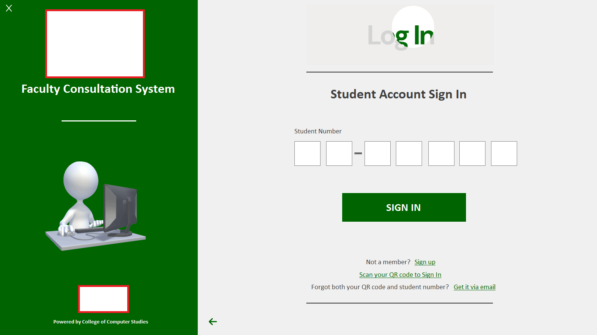
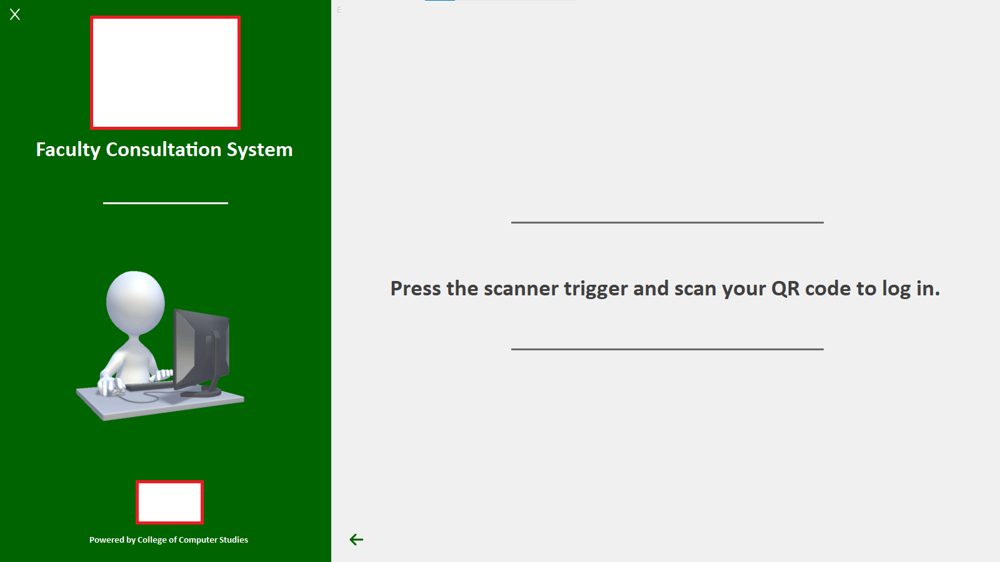
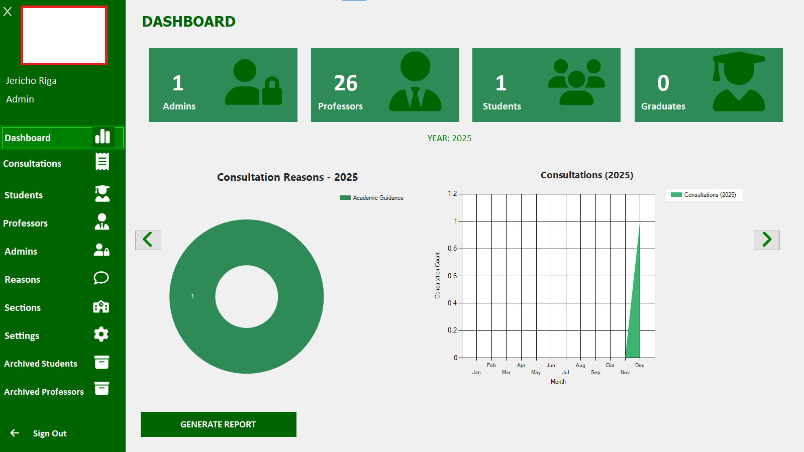
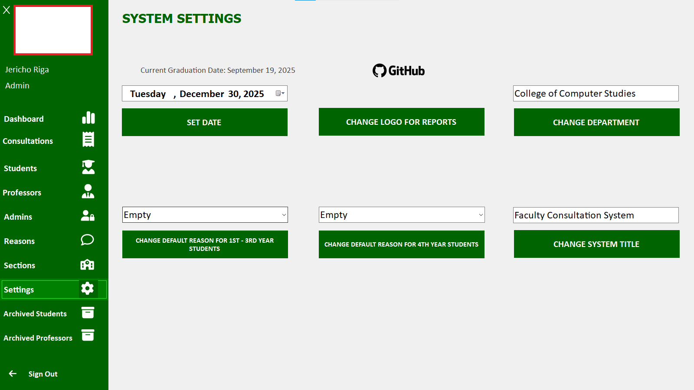

# Consultation System

## 📌 Overview

Reusable template system for managing consultations between professors and students. Tracks consultation purposes, generates analytics reports, and supports institutional customization.

---

## ✨ Features

- QR code login system (QR sent via email after signup)
- Multi-role access (Students, Professors, Admin)
- Excel import for student data
- Customizable templates (system name, logos and more)
- Graduate functionality to move students to next level
- Archive/hide actions for records

---

## 🖼️ Screenshots

<p align="center">
  
  
  
  <br/>
  
  
  
</p>

---

## 🛠️ Tech Stack
| Component | Technology |
|-----------|------------|
| Framework | .NET Framework |
| Language | VB.NET |
| UI Library | Guna UI |
| Database | MariaDB |
| Server | XAMPP |

---

## 🚀 Installation

1. **Setup Database**

```bash
# Ensure MariaDB is running via XAMPP
# Create and configure the required database
Run the Application

bash
# Navigate to release folder and run:
plpfaculty/plpfaculty/bin/release/application.exe
Note: A configured MariaDB database is required before running the application. Ensure XAMPP services are running.
```
